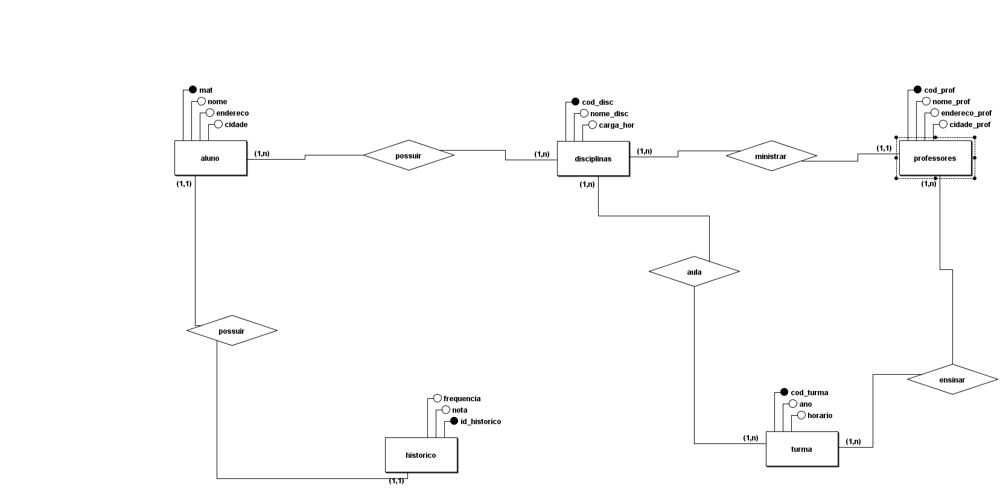
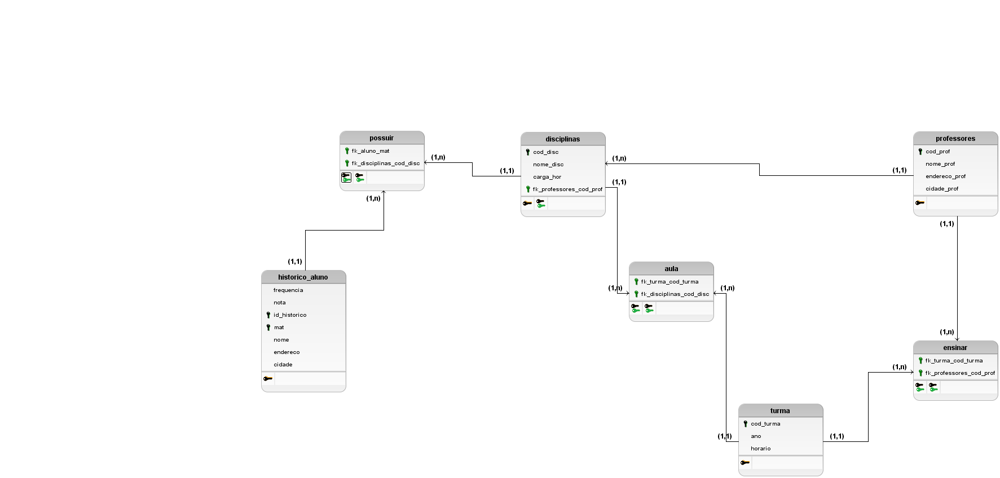

# provaDB

Integrantes do Grupo:

- Edmilson Júnior
- Ithala Kaynara

Professor: 

- Adeilson

## Modelo Conceitual:

## Modelo Lógico:

## Tabelas:

### Tabela _historico_aluno_:
A tabela "historico_aluno" é uma junção das entidades "historico" e "aluno", a junção dessas entidades resulta na criação desta tabela, que armazenará os atributos das entidades em uma só tabela. 
Nesta tabela, teremos como atributos/colunas:

- mat: matrícula do aluno (atributo identificador da entidade _aluno_)
- id_historico: identificador do histórico do aluno (atributo identificador da entidade _historico_)
- nome: nome do aluno
- endereco: endereço do aluno
- cidade: cidade em que o aluno mora
- frequencia: frequencia do aluno
- nota: nota do aluno

### Tabela _possuir_:
A tabela "possuir" foi criada a partir do relacionamento entre as entidades "aluno" e "disciplinas".
Nesta tabela, teremos como atributos/colunas:

- fk_aluno_mat: chave estrangeira que faz referência a _aluno_
- fk_disciplinas_cod_disc: chave estrangeira que faz referência a _displinas_

### Tabela _disciplinas_:
A tabela "disciplinas" é destinada ao armazenamento de informações das discplinas, como: código da disciplinas, nome da discplina e carga horária.
Nesta tabela, teremos como atributos/colunas:

- cod_disc: chave primária da tabela
- nome_disc: nome da disciplina
- carga_hor: carga horária da disciplina
- fk_professores_cod_prof: chave estrangeira que faz referência a _professores_

### Tabela _professores_:
A tabela "professores" é responsável por armazenar os dados dos professores, como: código do professor, nome, endereço e cidade.
Nesta tabela, teremos como atributos/colunas:

- cod_prof: chave primária
- nome_prof: nome do professor
- endereco_prof: endereço do professor
- cidade_prof: cidade do professor

### Tabela _ensinar_:
A tabela "ensinar" foi criada a partir do relacionamento entre _profesores_ e _turma_
Nesta tabela, teremos como atributos/colunas:

- fk_turma_cod_turma: chave estrangeira que faz referência a _turma_
- fk_professores_cod_prof: chave estrangeira que faz referência a _professires_

### Tabela _turma_:
A tabela "turma" é responsável por armazenar informações de cada turma em especifíco, como: código da turma, ano e horário.
Nesta tabela, teremos como atributos/colunas:

- cod_turma: chave primária
- ano: ano da turma
- horario: horário da turma

### Tabela _aula_:
A tabela "aula", surge a partir do relacionamento entre _turma_ e _disciplinas_.
Nesta tabela, teremos como atributos/colunas:

- fk_turma_cod_turma: chave estrangeira que faz referência a _turma_
- fk_disciplina_cod_disc: chave estrangeira que faz referência a _disciplinas_

