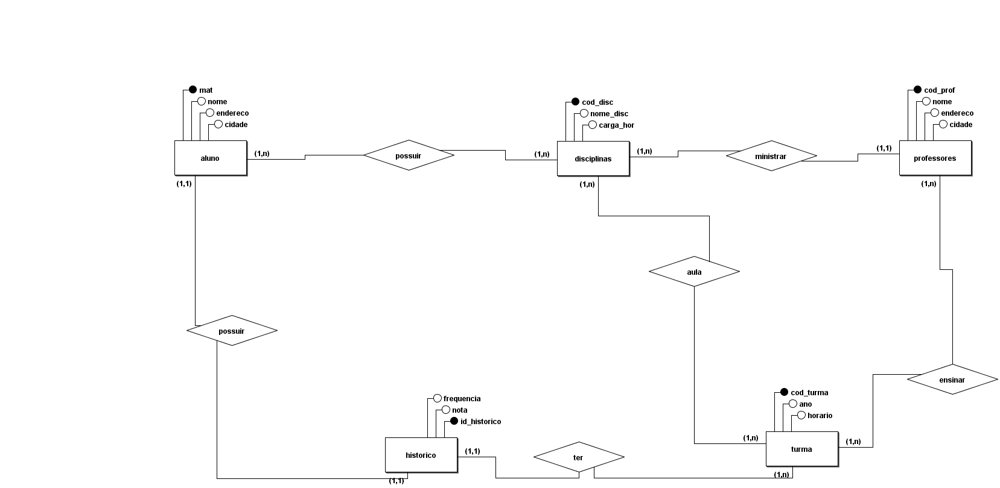
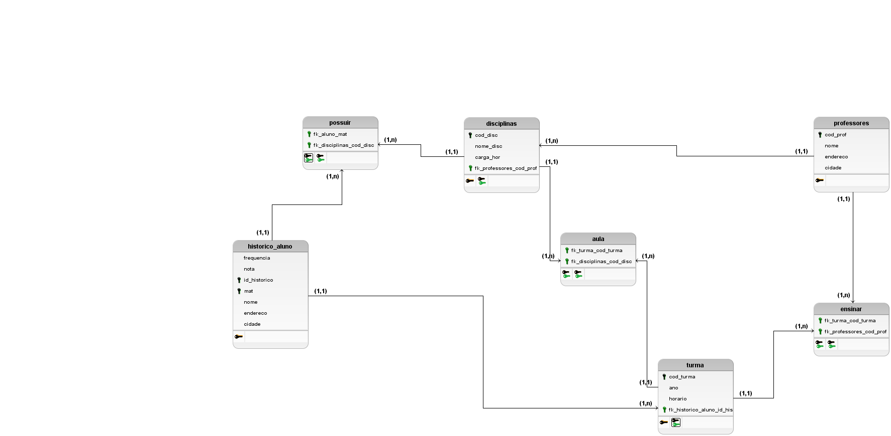

# provaDB

Integrantes do Grupo:

- Edmilson Júnior
- Ithala Kaynara

Professor: 

- Adeilson

## Modelo Conceitual:

## Modelo Lógico:

## Tabelas:

### Tabela _aluno_:
A tabela "aluno" é responsável por armazenar as informções de cada aluno, como: Matrícula, Nome do Aluno, Endereço, Cidade.
Nesta tabela, teremos como atributos/colunas:

- mat: matrícula do aluno (atributo identificador)
- nome: nome do aluno
- endereco: endereço do aluno
- cidade: cidade em que o aluno mora
- fk_historico_id_historico: chave estrangeira (chave estrangeira que faz referência a tabela historico)

### Tabela _possuir_:
A tabela "possuir" é uma tabela criada a partir do relacionamento entre as entidades "aluno" e "disciplinas".
Nesta tabela, teremos como atributos/colunas:

- fk_aluno_mat: chave estrangeira que faz referência a aluno
- fk_disciplinas_cod_disc: chave estrangeira que faz referência a displinas
